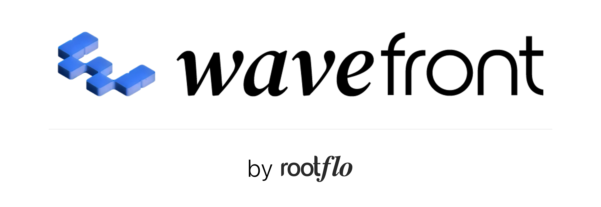
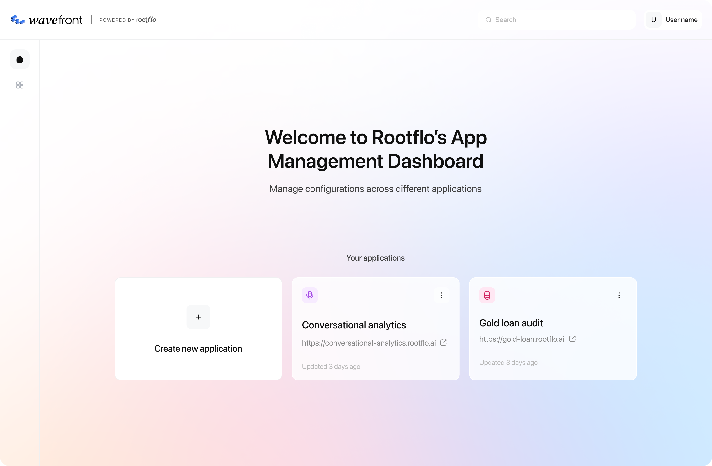

<p align="center">
  <a href="https://rootflo.ai">
  
  </a>
</p>
<h2 align="center">Enterprise AI Middleware For Building Production Ready AI Applications</h1>
<h3 align="center">Open source alternative to UnifyApps, LyzrAI, SuperAGI & AgentGPT</h3>
<h4 align="center">Alternative to n8n, for building enterprise grade AI workflows</h4>

<p align="center">
  <a href="https://github.com/rootflo/flo-ai/stargazers">
    
  </a>
  <a href="https://github.com/rootflo/flo-ai/releases">
    
  </a>
  <a href="https://github.com/rootflo/flo-ai/graphs/commit-activity">
    
  </a>
  <a href="#">
    
  </a>
  <br/>
</p>
<p align="center">
  <br/>
   <a href="https://github.com/rootflo/flo-ai">GitHub</a>
   •
    <a href="https://rootflo.ai" target="_blank">Website</a>
   •
    <a href="https://flo-ai.rootflo.ai" target="_blank">Documentation</a>
   •
    <a href="https://discord.gg/BPXsNwfuRU" target="_blank">Discord</a>
  </p>

  <p align="center">
  <a href="https://github.com/rootflo/flo-ai/tree/develop/flo_ai">
    
  </a>
  <br/>
  <sub>✨ <i>Powered by the flo-ai framework</i> ✨</sub>
</p>

  <hr />

## What is Wavefront ?

Wavefront AI is an open-source middleware platform for building production AI applications on enterprise data. It lets you:
- Connect to databases, APIs and cloud storage, and query them with access control and audit logging
- Use any LLM or SLM, hosted or self-hosted
- Build agents, multi-agent workflows, chatbots and voice agents on top of that data, configured in YAML and versioned
- Add authentication, role-based access control, observability and evaluation to all of them

## What people build with Wavefront ?
- AI agents and workflows that audit, underwrite, supervise contact centers and automate business processes
- Knowledge bases and RAG applications for internal enterprise use
- Voice agents for collections and sales, over inbound and outbound phone calls
- Chatbots that give each user a persistent conversation with a configured model
- Workflows that combine multiple data sources, knowledge bases and services


<p align="center">
  
</p>

| Project Information | Details |
|-----------|------------|
|**Release Status** | Beta Release| 
|**Wavefront License** | GNU AFFERO GENERAL PUBLIC LICENSE 3.0 |
|**FloAI License** | MIT LICENSE |

## ✨ Key Capabilities

- **🤖 Agents & Workflows**  
  Define agents and multi-agent workflows in YAML, built on [flo-ai](flo_ai). Every save creates a new version, validated by building the agent or compiling the workflow, and you can promote or roll back versions. Workflows can reference saved agents, define agents inline, or embed other workflows. Run them synchronously with streamed events, or asynchronously on background workers.

- **💬 Chatbots & Sessions**  
  Configure a chatbot as a system prompt bound to a model. Each user gets persistent chat sessions with stored history and streaming replies. Sessions keep a snapshot of the prompt they started with, so editing a chatbot never rewrites past conversations.

- **🔊 Voice Agents**  
  Voice-to-voice agents for inbound and outbound phone calls, built on [Pipecat](https://github.com/pipecat-ai/pipecat). They support multiple languages, tool calls during a call, smart turn detection, and LLM-based evaluation after each call.
  - Telephony: Twilio, Exotel, Smartflo
  - Speech-to-text: Deepgram, AssemblyAI, Whisper, Google, Azure, Sarvam, ElevenLabs
  - Text-to-speech: ElevenLabs, Deepgram, Cartesia, Azure, Google, AWS, Sarvam

- **🌐 Data Connectivity**  
  Connect to BigQuery, Redshift, PostgreSQL and SQL Server as datasources. Read and write through an OData-style API, or define parameterised dynamic queries in YAML and run or export them. Every datasource operation is audit logged. API services connect any REST backend, with API key, Basic and Bearer authentication. Cloud storage works with AWS, GCP and Azure.

- **🧠 Knowledge Bases & RAG**  
  Upload documents to knowledge bases, with background ingestion and embedding. Retrieval combines vector (pgvector) and keyword search with reranking, and supports image search.

- **🛠️ Tools & Triggers**  
  Agents can use datasources, knowledge bases, API services, email and custom message processors as tools. Triggers start an agent or workflow from external events, starting with Gmail.

- **🤖 Open Source & Proprietary Model Support**  
  OpenAI, Azure OpenAI, Anthropic, Google Gemini, Groq, Ollama and vLLM, managed centrally as reusable model configurations. flo-ai also supports Vertex AI and AWS Bedrock.

- **🔐 Authentication & Authorization**  
  Email/password, Google OAuth, Microsoft OAuth (Entra) and Microsoft ADFS sign-in. Role-based access control with users, groups, roles and resources, plus account lockout and reCAPTCHA protection.

- **📊 Observability, Monitoring & Evaluation**  
  Built-in OpenTelemetry telemetry pushed to any APM backend — local Jaeger, Azure Application Insights, AWS X-Ray/CloudWatch, GCP Cloud Trace, or any OTLP-compatible vendor. See the [OpenTelemetry guide](OPENTELEMETRY_ARCHITECTURE_GUIDE.md).

- **🖥️ Web Console**  
  A web console for configuring agents, workflows, chatbots, voice agents, datasources, knowledge bases, triggers and model providers across all your applications.

## Architecture

Each application runs as its own deployment, and a single console manages all of them.

```
                ┌──────────────────────────────┐
                │  floconsole                  │  manages apps, builders and access
                └──────┬───────────────┬───────┘
                       │               │
          ┌────────────▼───┐     ┌─────▼──────────┐
          │ floware (app A)│     │ floware (app B)│  one core server per application
          └────────────────┘     └────────────────┘
```

| Service | Role |
|---------|------|
| **floconsole** | Creates and manages applications, their users and access, and proxies requests to each app's floware |
| **floware** | The core server for one application: agents, workflows, chatbots, datasources, knowledge bases, tools, RBAC |
| **call_processing** | The real-time voice runtime that handles phone calls for voice agents |
| **Background jobs** | Celery workers for async agent and workflow runs, RAG ingestion, and scheduled workflow jobs |
| **inference_app** | Hosts custom PyTorch models (experimental) |

Because each application has its own floware, each gets its own database, storage and secrets.

## Quick Start

**Option 1**: [Schedule a demo](https://calendly.com/meetings-rootflo/30min) and we help you build immediately. 

**Option 2**: Self-host for maximum control and customization. Please find the self-hosting instructions in the [Wavefront Documentation](https://github.com/rootflo/wavefront/tree/develop/wavefront) and the [Docker setup guide](DOCKER_SETUP.md).

**Option 3**: Run Wavefront locally for development with the setup script.

### Local development setup

[`wavefront/setup.sh`](wavefront/setup.sh) sets up and starts the whole stack on your machine. It is safe to re-run: services that are already running are left as they are.

**Prerequisites**: Python 3.11+, [uv](https://docs.astral.sh/uv/), Docker (running), Node.js 20+, pnpm (`corepack enable`) and openssl. The script checks for all of them first.

```bash
cd wavefront
./setup.sh
```

The script:
1. Creates each service's `.env` from its checked-in sample (`.env.example` / `.env.sample`). If a `.env` already exists, it asks before replacing it and keeps a backup. Secrets such as `PASSTHROUGH_SECRET` are generated.
2. Starts Postgres (pgvector), Redis and [LocalStack](https://github.com/localstack/localstack) with `server/docker-compose.yml`. LocalStack provides S3, SQS and KMS locally, so no cloud account is needed.
3. Creates the databases, the S3 bucket, the RAG ingestion queue and the KMS keys used to sign tokens.
4. Installs the Python dependencies into `server/.venv` and the web client's dependencies.
5. Starts each service in its own terminal window, and waits until it is healthy.

| Service | URL | Reloads on code changes |
|---------|-----|-------------------------|
| Web client | http://localhost:5173 | Yes |
| floconsole | http://localhost:8002 | Yes |
| floware | http://localhost:8001 | Yes |
| inference_app *(optional)* | http://localhost:8003 | Yes |
| Celery worker *(optional)* | Redis queue | No, restart it |
| RAG ingestion worker *(optional)* | LocalStack SQS queue | No, restart it |

The script asks whether to run each optional service. The inference app downloads its models (several GB) from Hugging Face on first run, and needs a Hugging Face token with access to the gated DINOv3 model. It is skipped on Intel Macs, which have no supported PyTorch build.

When the script finishes:
1. Open the web client at http://localhost:5173 and log in with the seed user from `server/apps/floconsole/floconsole/.env` (`CONSOLE_EMAIL` / `CONSOLE_PASSWORD`).
2. Add floware as an app: **Apps → Create new app**, with App Name `localhost`, Deployment Type **Manual**, and `http://localhost:8001` as both the Public and Private URL.
3. Start building.

To stop a service, close its terminal window. To start it again, re-run `./setup.sh`.


## Platform Components

| Component | Description |
|---------|-------------|
| **flo-ai** | [FloAI](https://github.com/rootflo/flo-ai/tree/develop/flo_ai) library for Agent Building & A2A Orchestration. Detailed documentation is available [here](https://wavefront.rootflo.ai/flo-ai). |
| **wavefront-server** | The backend services: floconsole, floware, call processing and background workers. Detailed documentation is available [here](https://github.com/rootflo/wavefront/tree/develop/wavefront). |
| **wavefront-client** | The web console for configuring agents, workflows, chatbots, voice agents, models, datasources and RBAC. Details [here](https://github.com/rootflo/wavefront/tree/develop/wavefront). |
| **wavefront-cli** | For configuring through the command line, for full developer control (**Coming Soon**) |

## Roadmap

See [ROADMAP.md](ROADMAP.md) for detailed feature plans and contribution opportunities.

> [!WARNING]
> 
> - This project is under active development and APIs may change without notice. Please checkout the [platform docs](https://wavefront.rootflo.ai) for the latest information.
> - The platform is not in the GA state, and there are unimplemented features. Checkout [ROADMAP.md](ROADMAP.md) for the list of features, and what's missing.

## ⭐ Show Your Support

If you find Wavefront AI useful, please consider:

- Starring this repository ⭐
- Sharing with your network
- Contributing to the project
- Providing feedback and feature requests

---

## Next Steps

- [Join our Discord](https://discord.gg/BPXsNwfuRU)
- [Read our docs](https://wavefront.rootflo.ai/)
- [Submit an issue](https://github.com/rootflo/wavefront/issues/new/choose)
- [Talk to us](https://calendly.com/meetings-rootflo/30min)

Text us! <br>
[](https://x.com/viz_satiz)
[](https://x.com/ntinkster)
